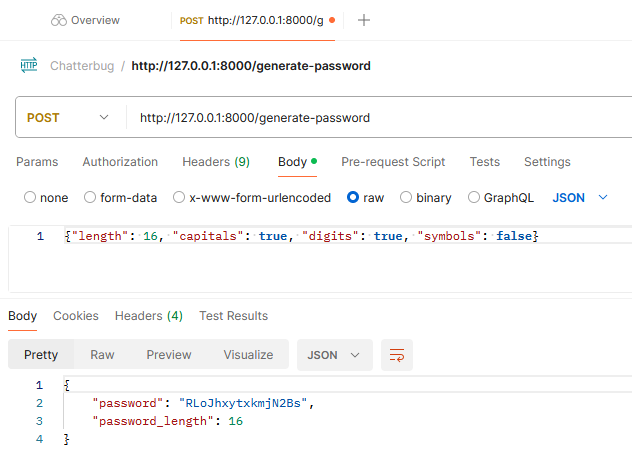
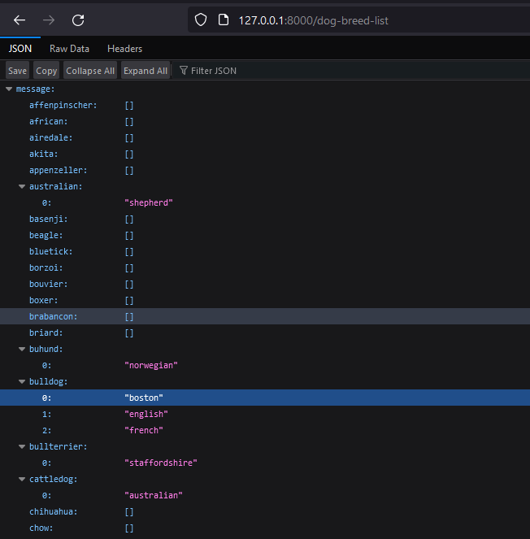

# ChatterbugFastAPIExercise

# Requirements
- python 3.12.2
## Pip libraries
- fastapi 0.110.1
- uvicorn[standard] 0.29.0

(Python and library versions are versions used during development and testing)

# Installation
Install python 3.12.2

Open a new terminal and verify you are using the correct version of python with ```py --list```. The currently used version will be marked with an asterix

Run the following commands:

```py -m pip install 'fastapi==0.110.1'```

```py -m pip install uvicorn[standard]==0.29.0```

```py -m pip install requests==2.31.0```

# Running the API
In a terminal, navigate to this folder, then run ```uvicorn main:app --reload```

# Testing the API

## Core Functionality
You can test the core functionality of the API using POSTMAN. To make POST calls to a locally running server first install the POSTMAN client

### /generate-password


## Secondary Functionality
The API also integrates a third party API "Dog API". Two GET endpoints exist for interacting with this API and can be tested from the browser.

### /dog-breed-list
Requests a JSON object containing a list of all the breeds and sub-breeds that can be used to query the second endpoint



### /dog-picture
Returns a HTML document with a link to a random dog picture. Takes two optional arguments "breed", and "sub_breed" that can be used to narrow down the random picture to a specific sub-breed of dog.


See the documentation for a list of all endpoints

# Documentation
FastAPI provides an automatically generated document you can view in the browser by visiting the "/docs" and "/redoc" endpoints while the server is running